# Lilka Wallpapers

Live home-screen wallpapers for the [Lilka](https://lilka.dev) console (KeiraOS Lua).

Each wallpaper is one `wallpaper.lua`. Copy it to the SD card as `/sd/wallpaper.lua`, and the launcher shows it on the home screen. Every script also runs as an app: open it from Keira's file manager.

| | |
| --- | --- |
| [**Aquarium**](aquarium/) — tropical fish in 2.5D  | [**Living Window**](window/) — sky and city by the real time 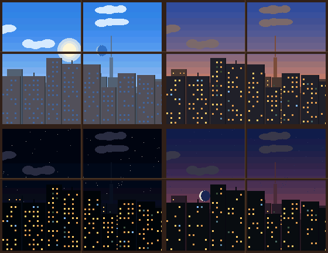 |
| [**Weather**](weather/) — Open-Meteo, animated *(Wi-Fi)* 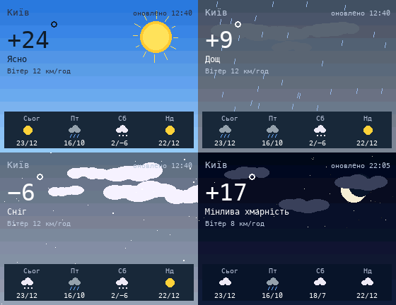 | [**Currency**](currency/) — NBU rates, 30-day charts *(Wi-Fi)* 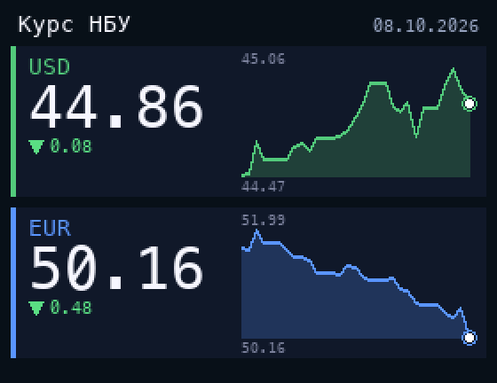 |
| [**GitHub**](github/) — contribution grid *(Wi-Fi)* 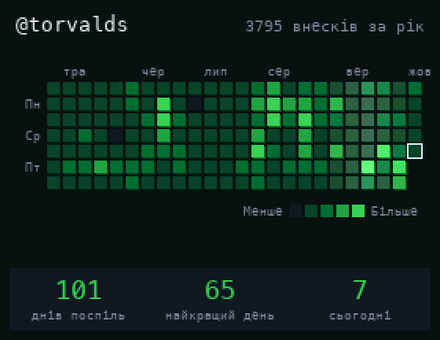 | [**Synthwave**](synthwave/) — neon grid and sun  |
| [**Boids**](boids/) — flock over sunflowers  | [**Campfire**](fire/) — Doom fire effect 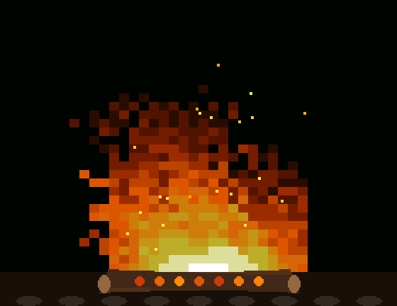 |
| [**Rain**](rain/) — drops on the window 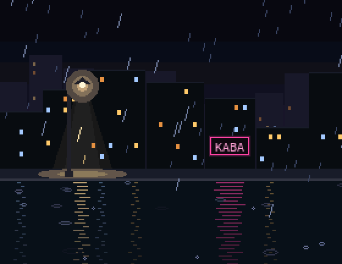 | [**Pet Cat**](pet/) — feed and play in the app 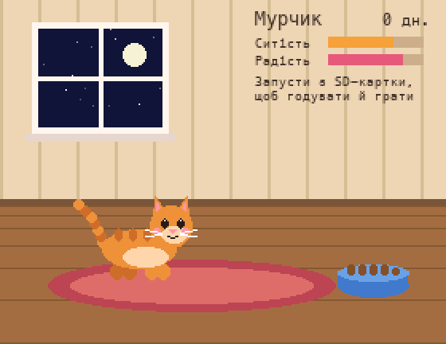 |
| [**Kyiv Metro**](metro/) — trains on schedule 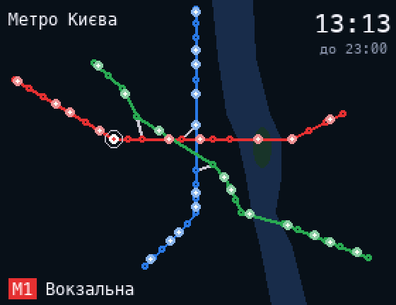 | [**Air Raid Alerts**](alerts/) — live map by oblast *(Wi-Fi)*  |
| [**Home Assistant**](ha/) — sensors and switches *(Wi-Fi)* 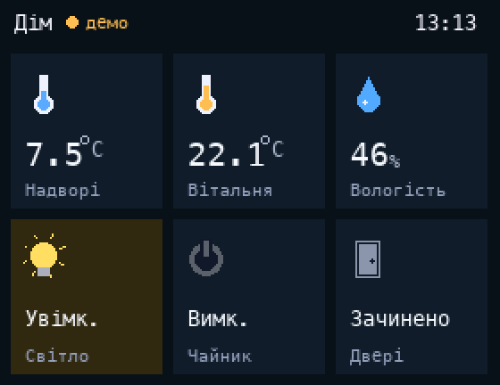 | |
| [**Starfield**](starfield/) — Keira's example 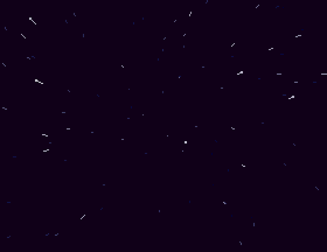 | [**ISS Tracker**](iss_tracker/) — live ISS position *(Wi-Fi)* 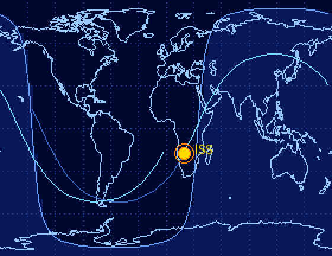 |

*(Wi-Fi)*: open the script as an app once to download data. Most of these wallpapers only show what is saved, because the launcher couldn't make network requests on older firmware. Air Raid Alerts and Home Assistant also refresh on the wallpaper with a recent Keira.

## Credits

- [alerts](alerts/) uses oblast borders from [geoBoundaries](https://www.geoboundaries.org) (CC BY 4.0).
- [starfield](starfield/) is the example from [lilka-dev/keira](https://github.com/lilka-dev/keira/blob/main/data/wallpaper.lua), unchanged.
- [iss_tracker](iss_tracker/) is a copy of [black-ghost-off/lilka_iss_tracker](https://github.com/black-ghost-off/lilka_iss_tracker), unchanged. See its own README for installing it.