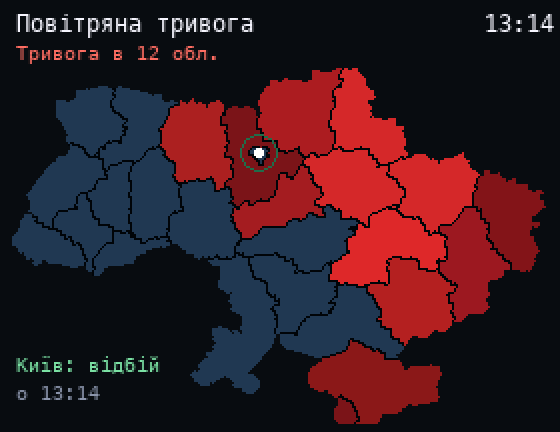

# Air Raid Alerts

A map of Ukraine with active air raid alerts by oblast, from the [ubilling.net.ua](https://ubilling.net.ua/aerialalerts/) API (no key needed). Oblasts with an alert pulse red, and ones where the alert just ended glow green for a few minutes. Your oblast is marked with a ring: set it in `HOME` at the top of the script (default `м. Київ`).

## Install

Copy `wallpaper.lua` to the SD card as `/sd/wallpaper.lua` and connect to Wi-Fi in Keira. The data refreshes every 30 seconds, in the app and on the wallpaper (wallpapers need a recent Keira with network modules). On older firmware, open `/sd/wallpaper.lua` from the file manager to refresh. The last state is saved in `alerts.txt`, and the map turns grey when it is older than 15 minutes.

The API has no separate entry for Crimea, so it shows Sevastopol's status.

## Controls (app only)

| Button | Action |
| --- | --- |
| A | Refresh |
| START | Exit |

## Map

Oblast borders are from [geoBoundaries](https://www.geoboundaries.org) (CC BY 4.0), baked into the script by `tools/gen_map.py`.
