# Motion Demo

A demoscene reel: ten animated scenes take turns every 9 seconds, with blinds and squares transitions between them.

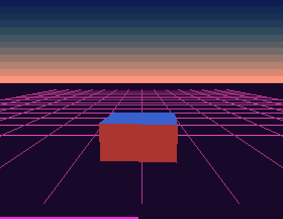

## Scenes

| | |
| --- | --- |
| **Plasma** 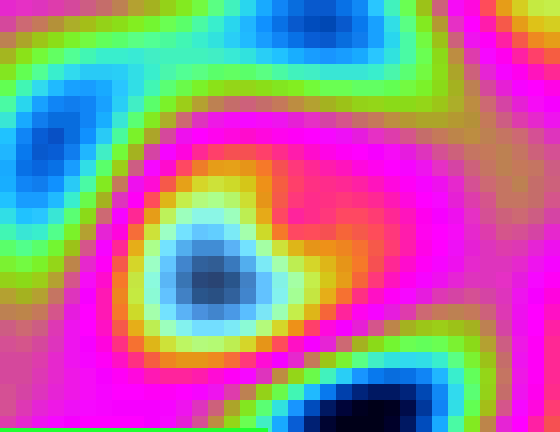 | **Tunnel** 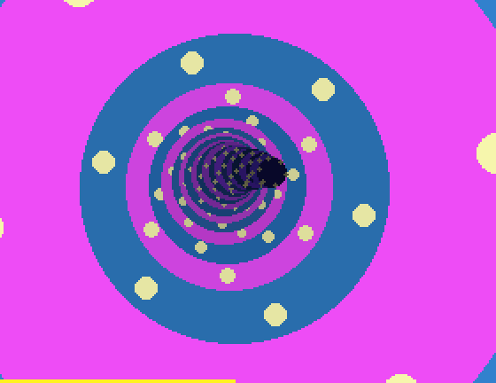 |
| **Morph** — sphere, torus, cube, knot, helix 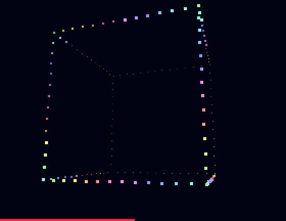 | **Squash & Stretch** — bouncing cube 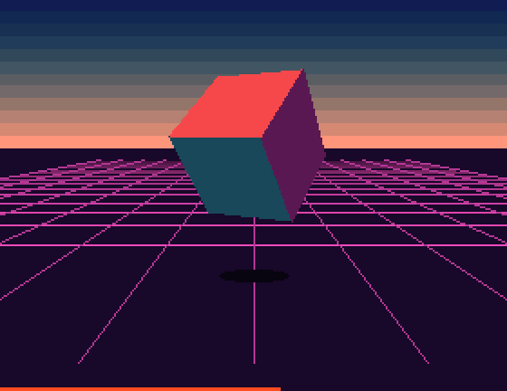 |
| **Twister** 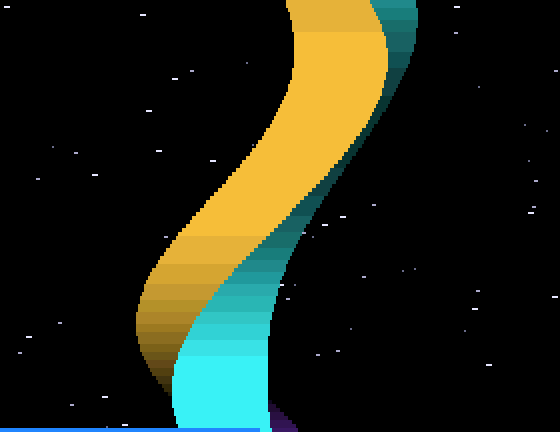 | **Copper & Scroll** — bars, logo, sine scroller 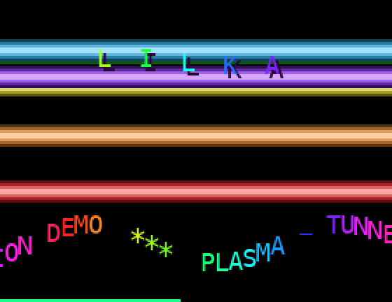 |
| **Easing** — six easing functions 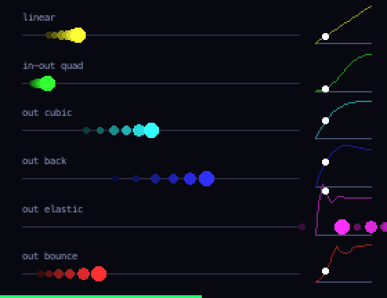 | **Fireworks** — over a city 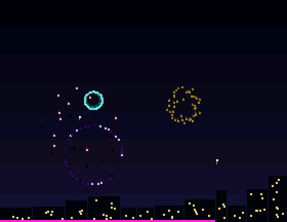 |
| **Waves** — 3D wireframe surface 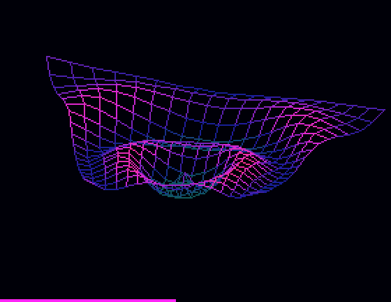 | **Harmonograph** 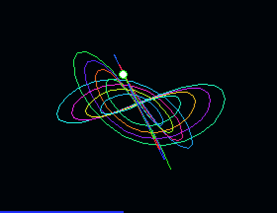 |

## Install

Copy `wallpaper.lua` to the SD card as `/sd/wallpaper.lua`. The launcher shows it on the home screen.

## Controls (app only)

| Button | Action |
| --- | --- |
| ← → | Previous / next scene |
| A | Pause scene switching |
| START | Exit |
